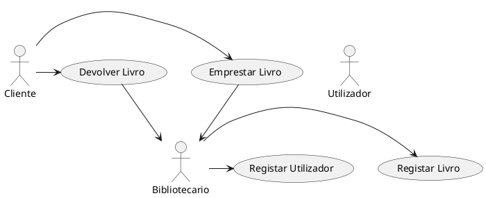
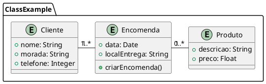
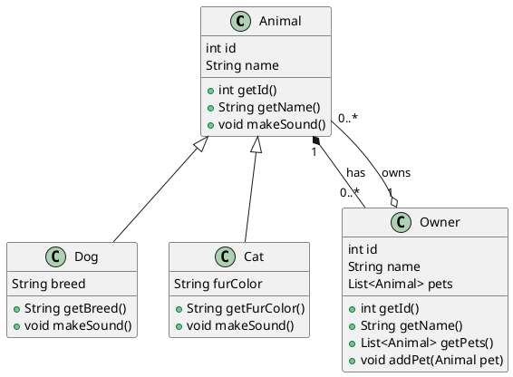
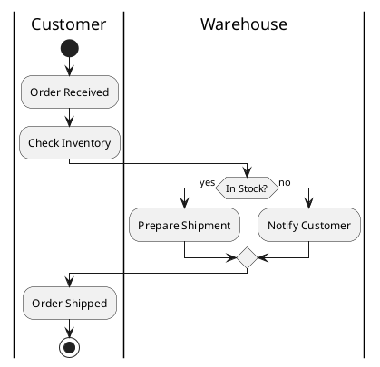
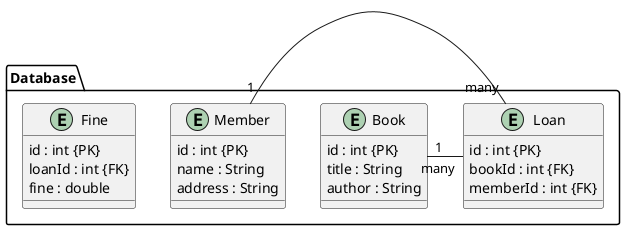
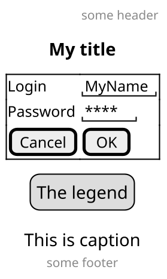
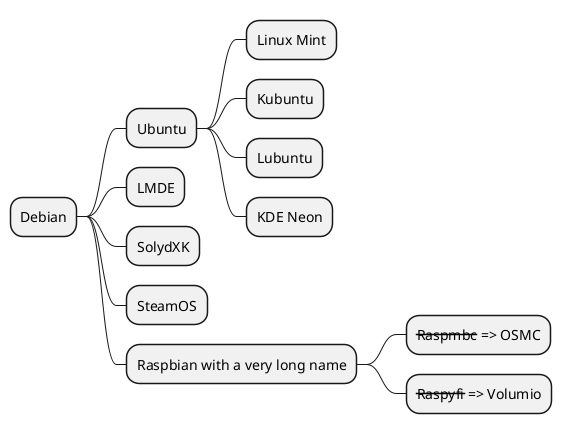

# PlantUML

## Caraterísticas

O PlantUML é uma ferramenta versátil para gerar vários tipos de diagramas, incluindo diagramas UML, diagramas de sequência, diagramas de actividades:

**Diagramas UML:**

* Diagramas de classe: Representam a estrutura de um sistema, incluindo classes, atributos e relacionamentos
* Diagramas de sequência: mostram as interações entre objectos ao longo do tempo.
* Diagramas de casos de utilização: descrevem a funcionalidade de um sistema na perspetiva dos seus utilizadores.
* Diagramas de atividade: modelam o fluxo de atividades em um processo.
* Diagramas de estado:** Representam os diferentes estados de um objeto e as transições entre eles.

**Outros tipos de diagramas:******

* Diagramas de componentes: mostram os componentes de um sistema e suas dependências.
* Diagramas de implantação: ilustram a arquitetura física de um sistema.
* Diagramas de objetos: representam instâncias de classes em um ponto específico no tempo.
* Diagramas de temporização: mostram o comportamento de objetos ao longo do tempo, com foco em suas vidas úteis e mudanças de estado.

**Sintaxe e recursos:**
* Sintaxe simples: PlantUML usa uma sintaxe concisa e fácil de aprender para definir diagramas.
* Personalização: É possível personalizar a aparência dos diagramas usando várias opções, como cores, fontes e layouts.
* Integração: PlantUML integra-se com muitos editores de texto e IDEs, permitindo-lhe criar diagramas diretamente no seu ambiente de desenvolvimento.
* Geração de código: Algumas ferramentas podem gerar código a partir de diagramas PlantUML, simplificando o processo de desenvolvimento.
* Opções de exportação: É possível exportar diagramas em vários formatos, incluindo PNG, SVG e PDF.

**Caraterísticas adicionais:**
* Colaboração: O PlantUML pode ser utilizado para colaborar com outras pessoas nos diagramas, o que o torna uma ferramenta valiosa para o trabalho em equipa.
* Controlo de versões: Pode integrar o PlantUML com sistemas de controlo de versões para acompanhar as alterações aos seus diagramas.
* Automatização: O PlantUML pode ser usado para automatizar a criação de diagramas, por exemplo, com base em alterações de código ou outros eventos.

## Instalação

### Windows

Para instalar o PlantUML no Windows, siga estes passos:

1. Faça o download do PlantUML a partir do [site oficial](https://plantuml.com/download).
2. Extraia o conteúdo do arquivo ZIP para uma pasta no seu computador.
3. Adicione o caminho da pasta bin do PlantUML ao PATH do sistema.
4. Abra uma janela de comando e execute o comando `plantuml -version` para verificar se a instalação foi bem-sucedida.
5. Se o comando retornar a versão do PlantUML, a instalação foi bem-sucedida.

### Linux

Para instalar o PlantUML no Linux, siga estes passos:

1. Abra um terminal e execute o comando `sudo apt-get install plantuml` para instalar o PlantUML a partir dos repositórios oficiais.
2. Execute o comando `plantuml -version` para verificar se a instalação foi bem-sucedida.
3. Se o comando retornar a versão do PlantUML, a instalação foi bem-sucedida.
4. Se preferir, pode instalar o PlantUML manualmente a partir do [site oficial](https://plantuml.com/download).
5. Para instalar o PlantUML manualmente, faça o download do arquivo ZIP, extraia o conteúdo e adicione o caminho da pasta bin do PlantUML ao PATH do sistema.
6. Verifique a instalação executando o comando `plantuml -version`.
7. Se o comando retornar a versão do PlantUML, a instalação foi bem-sucedida.
8. Se encontrar problemas durante a instalação, consulte a [documentação oficial](https://plantuml.com/download) para obter ajuda.

### Pandoc

Para converter o ficheiro Markdown para docx ou PDF, pode ser utilizado o Pandoc. A conversão com os diagramas pode ser realizada,
com o (filtro para pandoc do PlantUML)[https://pypi.org/project/pandoc-plantuml-filter/], também disponível no (github)[https://github.com/pesobreiro/pandoc-plantuml-filter]. Isto corresponde à versão 0.1.5, 
para funcionar corretamente têm que fazer um pouco de hacking no source. 
Comando para instalar:

```bash
pip install pandoc-plantuml-filter
pip show pandoc-plantuml-filter
```

Editar o source:

```python 
# onde esta
subprocess.check_call(PLANTUML_BIN.split() + ["-t" + filetype, src])
# substituir por 
subprocess.check_call(['java', '-jar', PLANTUML_BIN, "-t" + filetype, src])
```


## Porquê utilizar PlantUML?

* É muito eficiente permite gerar uma grande variedade de diagramas sem necessidade de ferramentas de desenho complexas. A aproximação facilita o controlo de versões e a colaboração integrada no git 
* Permite criar desde fluxogramas básicos a arquitecturas de sistemas complexos;
* Pode ser integrada com várias ferramentas e IDEs
* Permite trabalhar com o Markdown e outros formatos, o que facilita a documentação e o desenvolvimento de diagramas mais fluido
* O PlantUML é gratuito e opensource.

# Gerar código a partir PlantUML

* PlantUML Integration: This extension provides a seamless integration of PlantUML into Visual Studio Code. It allows you to generate PlantUML diagrams directly from your Python code.
* UML Diagrams for Visual Studio Code: This extension supports a variety of diagram types, including class diagrams, sequence diagrams, and activity diagrams. It can be used to generate PlantUML diagrams from your Python code.

# Exetenções para Visual Studio Code

* [PyUML Generator](https://marketplace.visualstudio.com/items?itemName=IuriPavani.python-uml)
* [CSharp to PlantUML](https://marketplace.visualstudio.com/items?itemName=adrianwilczynski.csharp-to-plantuml)

Isto é um exemplo...


## Diagrama de casos de uso



## Diagramas de classe



Mais um exemplo de diagrama de classes obtido [aqui](https://mycodingdays.com/uml_modeling_with_plantuml_a_comprehensive_guide_with_examples/):



## Diagramas de atividade



## Diagrama Entidade-Relacão



# Criar protótipos de interfaces gráficas




# Mindmaps



# Mais exemplos

Outros diagramas disponíveis [aqui](https://crashedmind.github.io/PlantUMLHitchhikersGuide/).

## Conclusão

TODO:

## Biliografia
TODO:
